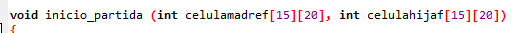
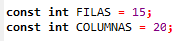
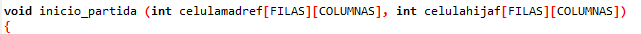

# EL JUEGO DE LA VIDA

# About
    Este fue mi primer gran reto como programador. Un juego que no conocía y me atraía más que el Buscaminas y la guerra Naval.
    Y que posteriormente me hicieron mejorarlo refactorizandolo.
    

## HISTORIA DEL JUEGO

    El juego de la vida es un automata celular diseñado por el matematico britanico 
    John Horton Conway en 1970.
    Hizo su primera aparicion pública en el numero de octubre de 1970 de la revista Scientific 
    American, en la columna de juegos matematicos de Martin Gardner. Desde un punto de vista 
    teorico, es interesante porque es equivalente a una maquina universal de Turing, es decir, todo lo 
    que se puede computar algoritmicamente se puede computar en el juego de la vida.
    Desde su publicacion, ha atraido mucho interes debido a la gran variabilidad de la evolucion de los 
    patrones. Se considera que la vida es un buen ejemplo de emergencia y autoorganizacion. Es 
    interesante para los cientificos, matematicos, economistas y otros observar como patrones 
    complejos pueden provenir de la implementacion de reglas muy sencillas.
    Para muchos aficionados, el juego de la vida solo era un desafio de programacion y una manera 
    divertida de usar ciclos de la CPU. Para otros, sin embargo, el juego adquirio mas connotaciones 
    filosoficas. Desarrollo un seguimiento casi fanatico a lo largo de los años 1970 hasta mediados de 
    los 80.
 
## EN QUE CONSISTE EL JUEGO DE LA VIDA
    El juego de la vida es en realidad un juego de cero jugadores, lo que quiere decir que su evolucion 
    esta determinada por el estado inicial y no necesita ninguna entrada de datos posterior. El 'tablero'
    de juego' es una malla formada por cuadrados ('celulas') que se extiende por el infinito en todas las 
    direcciones. Cada celula tiene 8 celulas vecinas, que son las que estan proximas a ella, incluidas las 
    diagonales. Las celulas tienen dos estados: estan 'vivas' o 'muertas' (o 'encendidas' y 'apagadas'). 
    El estado de la malla evoluciona a lo largo de unidades de tiempo discretas (se podria decir que por 
    turnos). El estado de todas las celulas se tiene en cuenta para calcular el estado de las mismas al 
    turno siguiente. Todas las celulas se actualizan simultaneamente.
    Las transiciones dependen del numero de celulas vecinas vivas:
    Una celula muerta con exactamente 3 celulas vecinas vivas 'nace' (al turno siguiente estara viva).
    Una celula viva con 2 o 3 celulas vecinas vivas sigue viva, en otro caso muere o permanece muerta 
    (por 'soledad' o 'superpoblacion').
 
## OPCIONES DEL JUEGO
    1-Introducir celulas vivas manualmente
             -Iras anyadiendo manualmente el numero de celulas vivas que consideres oportuno, para ello 
             tienes que indicar en que fila y columna quieres que se inserten y posteriormente decidir si 
             quieres pasar manualmente las generaciones o que se realicen automáticamente
             -Si decides que se pasen automáticamente tendrás que indicar el número de 
             generaciones que quieres pasar y la velocidad de paso de estas.
    2-Generando Aleatoriamente la configuracion inicial
             -Primero se te indica que numero de celulas quieres que introduzca el sistema. Y este 
             aleatoriamente las ira repartiendo por el tablero. Es posible que si pones un numero 
             pequeño de celulas o se mueran todas pronto o queden estáticas.
    3-Introduciendo una Figura Predefinida
             -Nos mostrara las 4 figuras predefinidas que tenemos para cargar en el tablero. Una vez 
             escogida la figura introduciremos la fila y la columna donde queramos que se introduzca 
             esta. A continuacion podremos escoger si hacer la evolucion de las generaciones 
             manualmente o automaticamente. Si escogemos automaticamente Nos pedira tambien que 
             introduzcamos la cantidad de generaciones que queremos mostrar y la velocidad de evolucion. 
             
# REFACTORIZACIONES

   - Tenemos dos matrices de 15 filas y 20 columnas.     
   
   
   - Así que cambiaremos esos magic numbers por dos constantes FILAS con un valor de 15 y COLUMNAS con un valor de 20.     
       
   
   
   - Y cambiamos los màgic number por FILAS y COLUMNAS.     
   
   
   - Esto mismo lo aplicamos a todas las matrices y también en condicionales donde aparecen 15 o 20 para referirse a filas y columnas, cómo por ejemplo este:     
   
   
   - Cambiamos también nombres de variables para hacerla más comprensibles: c y f son cambiadas por columnas y filas respectivamente.     
   
   
   - Creamos dos nuevas constantes  CELULA_VIVA y CELULA_MUERTA dándole el valor char a la constante y que se lea mejor el código cuando se pintan las células.       
        
   )     
   
 
